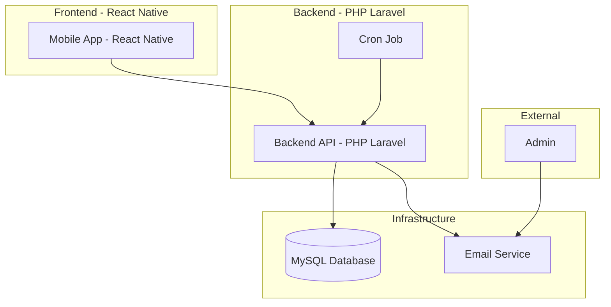
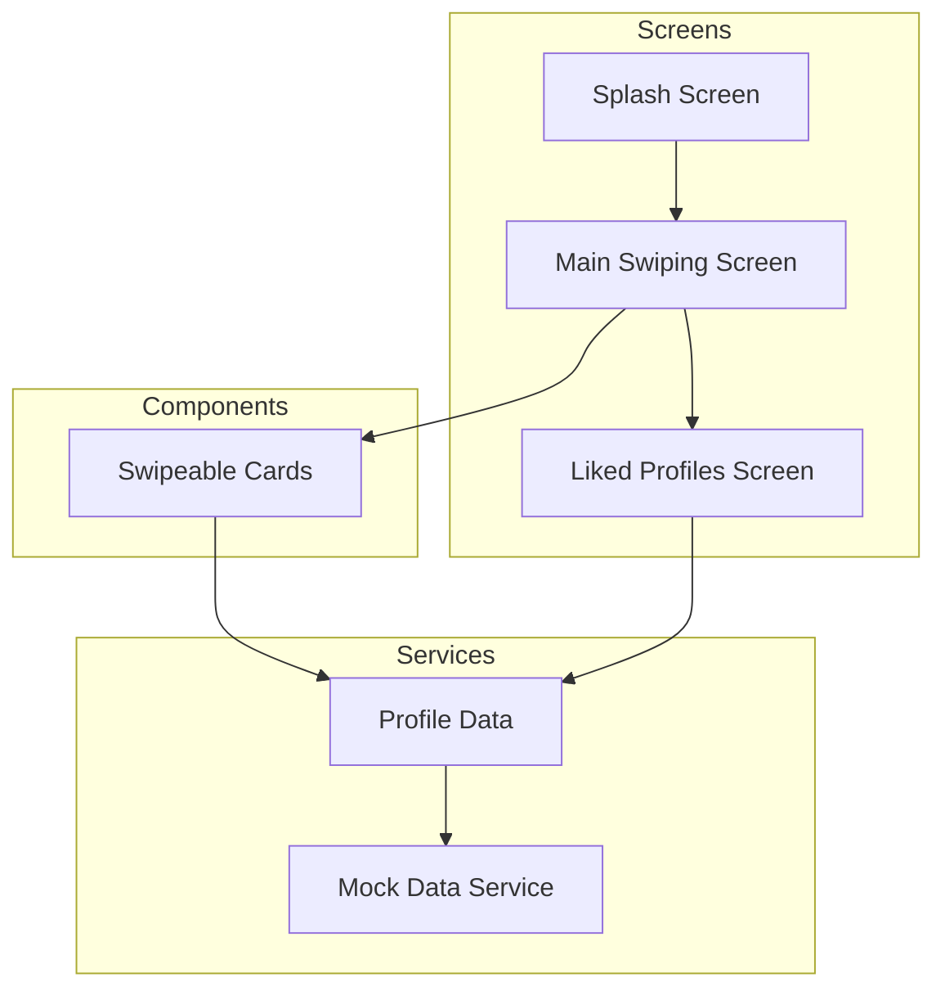
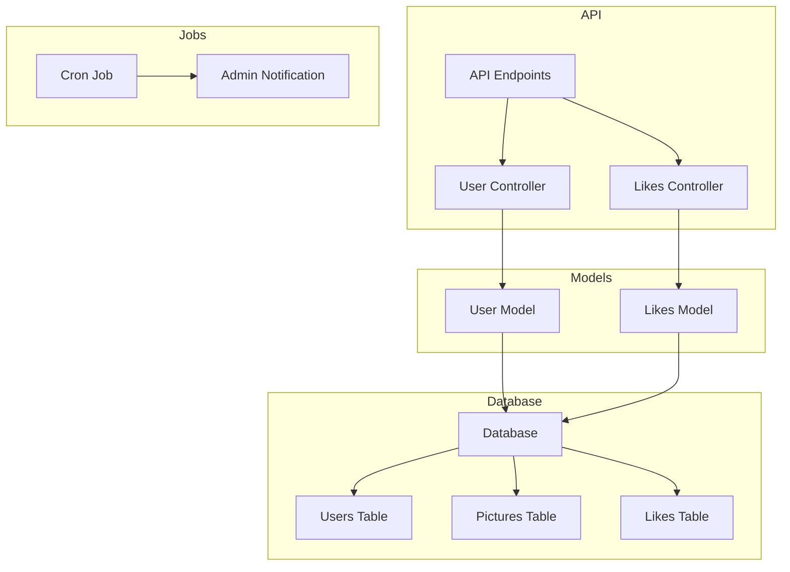
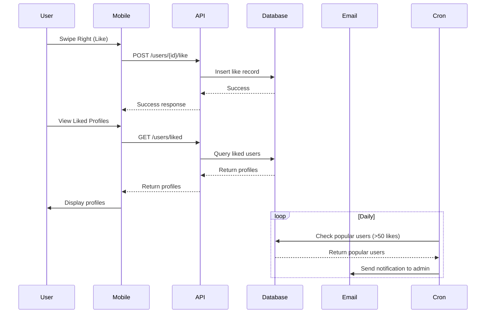

# Tinder App Architecture

## System Overview



## Mobile App Components



## Backend API Structure



## Data Flow



## Folder Structure

```
tinder-app/
├── app/                     # Mobile app source code
│   ├── (tabs)/             # Tab navigation
│   ├── components/         # Reusable components
│   │   └── SwipeableCard.tsx
│   ├── screens/            # App screens
│   │   ├── splash.tsx
│   │   ├── SwipingScreen.tsx
│   │   └── LikedProfilesScreen.tsx
│   ├── services/           # Data services
│   │   └── profileService.ts
│   ├── types/              # TypeScript types
│   │   └── profile.ts
│   └── _layout.tsx         # Navigation layout
├── backend/                # Backend documentation
│   ├── PLAN.md             # Implementation plan
│   └── api-spec.yaml       # API specification
├── components/             # Shared components
├── constants/              # App constants
├── hooks/                  # Custom hooks
├── assets/                 # Images and assets
└── README.md              # Project documentation
```

## Technology Stack

### Frontend
- **Framework**: React Native with Expo
- **Language**: TypeScript
- **Navigation**: Expo Router
- **State Management**: Built-in React state
- **Gestures**: React Native Gesture Handler
- **Animations**: React Native Reanimated

### Backend
- **Framework**: PHP Laravel
- **Database**: MySQL
- **API Documentation**: Swagger/OpenAPI
- **Scheduling**: Laravel Task Scheduling
- **Email**: Laravel Mail

## Key Features Implemented

### Mobile App
1. **Splash Screen**
   - Custom branded loading screen
   - Automatic transition to main app

2. **Swiping Interface**
   - Tinder-like card swiping
   - Gesture recognition for like/dislike
   - Visual feedback during swiping
   - Double-tap to like
   - Manual action buttons

3. **Profile Display**
   - User cards with images
   - Name, age, location, and bio
   - Stack-based card presentation

4. **Liked Profiles**
   - Dedicated screen for liked users
   - List view of all liked profiles
   - Empty state handling

### Backend (Planned)
1. **RESTful API**
   - Recommended profiles endpoint
   - Like/dislike endpoints
   - Liked profiles endpoint

2. **Database Schema**
   - Users table
   - Pictures table
   - Likes table
   - Matches table (future enhancement)

3. **Cron Jobs**
   - Daily check for popular users
   - Admin email notifications

4. **Documentation**
   - OpenAPI specification
   - Swagger UI integration